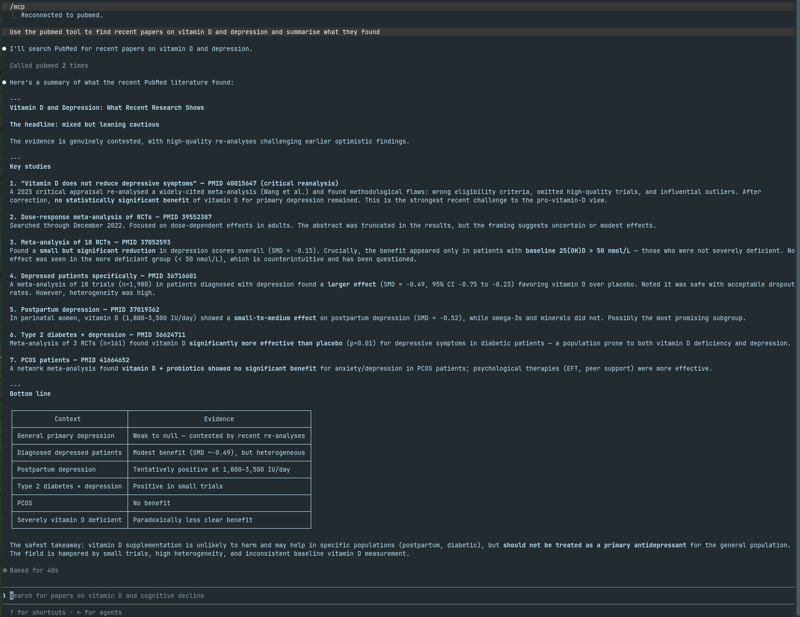
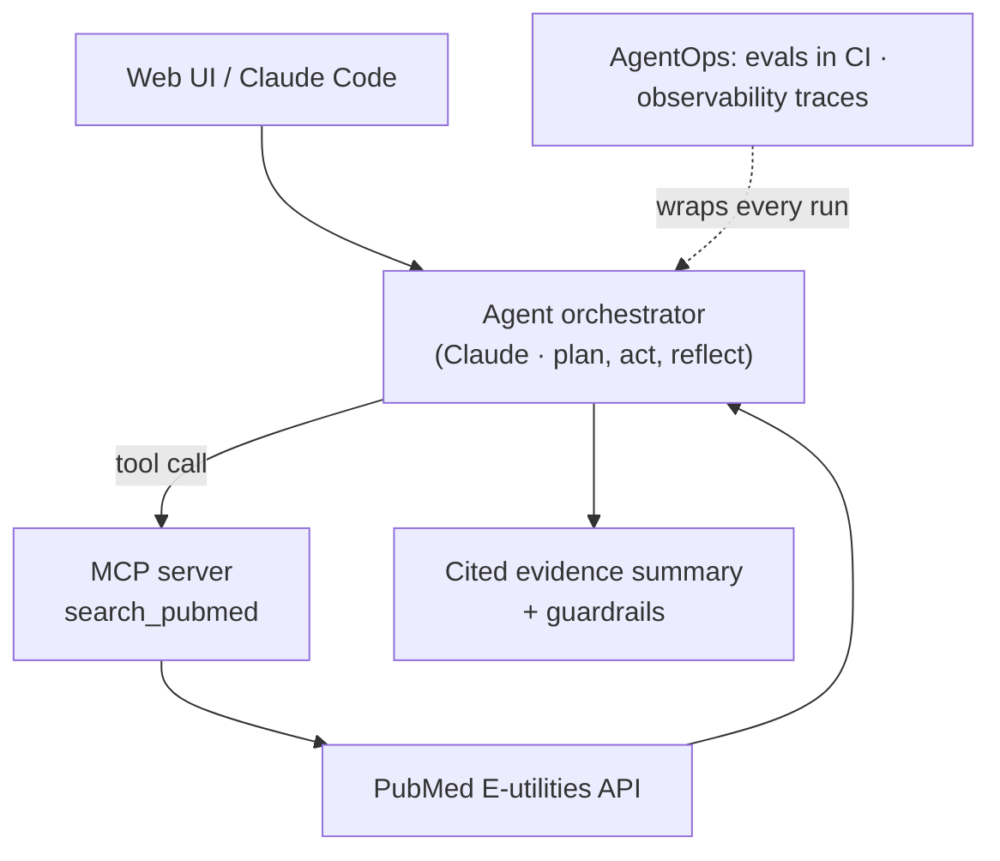

# 🔬 BioScout — Agentic Biomedical Research Assistant
 
[](https://github.com/bensonkachappilly/biomedical-research-assistant/actions/workflows/ci.yml)
[](https://www.python.org/)
[](https://biomedical-research-assistant.streamlit.app)
 
**BioScout answers biomedical research questions using live evidence from PubMed — and cites every claim so you can verify it yourself.**
 
🌐 **Live demo: [biomedical-research-assistant.streamlit.app](https://biomedical-research-assistant.streamlit.app)**
 
---
 
## What it is
 
BioScout is an AI agent for evidence-based biomedical questions. Ask it something like *"Does vitamin D deficiency increase the risk of depression?"* and it searches PubMed, reads the returned abstracts, and writes a grounded answer with inline `[PMID]` citations — declining to answer when the evidence isn't there rather than guessing.
 
It is built as a small but complete, production-minded system: a real agent loop, a reusable tool exposed over the Model Context Protocol (MCP), guardrails against hallucinated citations, observability traces, an automated evaluation suite, CI on every push, and a containerised deployment.
 
<!-- Add a screenshot of the Streamlit app here, e.g.:

-->
 
## Demo: the MCP server inside Claude Code
 
The PubMed tool is packaged as an MCP server, so it works in any MCP client — not just the web app. Below, Claude Code calls the `search_pubmed` tool directly and synthesises a cited literature summary:
 
<!-- Add the Claude Code screenshot here, e.g.:

-->
 
## Key features
 
- **Agentic tool-calling loop** — the model decides when to search, refines its own queries, and searches again until it has enough evidence before answering.
- **Custom MCP server** — the PubMed search tool is exposed over the Model Context Protocol and is registered and usable inside Claude Code.
- **Retrieval-augmented answers** — every response is grounded in abstracts retrieved live from PubMed, with `[PMID]` citations.
- **Guardrails** — an out-of-scope filter, a hard cap on agent steps, and a check that withholds answers citing PubMed IDs that were never actually retrieved.
- **Observability** — each run is traced to JSON: per-step tool calls, token usage, latency, and an estimated cost.
- **Evaluation suite** — a set of test questions scored automatically on scope accuracy, retrieval, citation presence, and citation faithfulness, with pass/fail thresholds.
- **CI/CD** — fast, deterministic unit tests run on GitHub Actions on every push.
- **Containerised** — a `Dockerfile` runs the whole app reproducibly anywhere.
## Architecture
 

 
## How it works
 
1. **Scope check** — a quick model call confirms the question is a biomedical one before any expensive work begins.
2. **Agent loop** — Claude is given the `search_pubmed` tool and decides when and how to use it, issuing one or more refined searches.
3. **Retrieval** — the tool queries PubMed's E-utilities API (`esearch` + `efetch`) and returns titles and abstracts.
4. **Grounded synthesis** — the model answers using only the retrieved abstracts, citing each claim by PubMed ID.
5. **Guardrails** — the answer is checked; any citation to a PMID that wasn't retrieved causes the answer to be withheld.
6. **Trace** — the whole run (steps, tokens, latency, cost) is written to a JSON file for inspection.
## Tech stack
 
| Area | Tools |
|------|-------|
| Language | Python 3.12 |
| LLM | Claude (Anthropic SDK) |
| Tooling protocol | Model Context Protocol (MCP) — server + client |
| Data source | PubMed E-utilities API |
| Web UI | Streamlit |
| Testing | pytest |
| CI/CD | GitHub Actions |
| Packaging | Docker |
| Dev workflow | Built with Claude Code |
 
## Project structure
 
```
.
├── pubmed.py          # PubMed E-utilities search + abstract retrieval
├── core.py            # Pure, testable logic (citation guardrails)
├── pubmed_server.py   # MCP server exposing search_pubmed
├── agent_mcp.py       # Agent loop that consumes the MCP server
├── agent_traced.py    # Agent + guardrails + observability traces
├── web_backend.py     # Synchronous answer function for the web app
├── app.py             # Streamlit UI
├── evals.py           # Evaluation suite with scored thresholds
├── test_bioscout.py   # Unit tests (run in CI)
├── Dockerfile         # Containerised deployment
├── requirements.txt
└── .github/workflows/ci.yml
```
 
## Run it locally
 
```bash
git clone https://github.com/bensonkachappilly/biomedical-research-assistant.git
cd biomedical-research-assistant
 
conda create -n bioscout python=3.12 -y
conda activate bioscout
pip install -r requirements.txt
```
 
Add your Anthropic API key to a `.env` file (this file is gitignored and never committed):
 
```
ANTHROPIC_API_KEY=sk-ant-...
```
 
Then run the web app:
 
```bash
streamlit run app.py
```
 
Or run it in Docker:
 
```bash
docker build -t bioscout .
docker run -p 8501:8501 -e ANTHROPIC_API_KEY="sk-ant-..." bioscout
```
 
## Use the PubMed tool in Claude Code
 
Register the MCP server (use absolute paths to your environment's Python and the server file):
 
```bash
claude mcp add --scope user pubmed -- /path/to/envs/bioscout/bin/python /path/to/pubmed_server.py
claude mcp list
```
 
Then, in a Claude Code session, ask it to use the `pubmed` tool — it will call your server directly.
 
## Testing and evaluation
 
```bash
pytest -q          # fast unit tests (also run automatically in CI)
python evals.py    # full evaluation suite against the agent (calls the API)
```
 
Unit tests run on every push via GitHub Actions. The evaluation suite is run on demand, since it makes live API calls.
 
## Possible enhancements
 
- Dense-vector retrieval (embeddings + a vector store) over a larger corpus.
- Scheduled evals in CI with the API key stored as a repository secret.
- Full-text retrieval beyond abstracts; multi-tool agents (e.g. clinical-trials data).
## Disclaimer
 
BioScout is an educational demonstration. It does **not** provide medical advice. Always consult a qualified healthcare professional.
